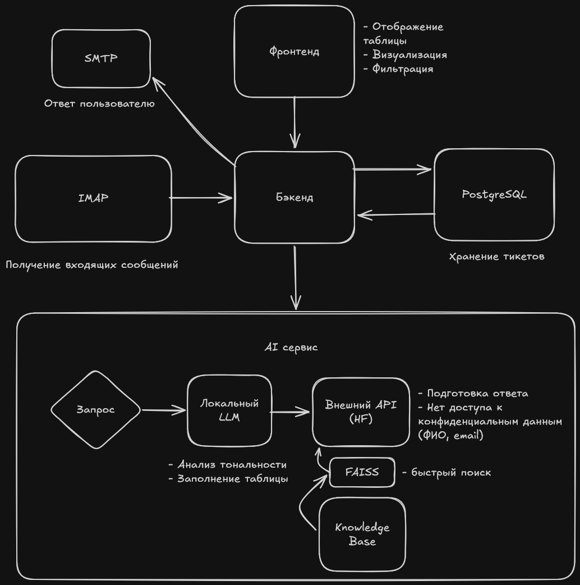
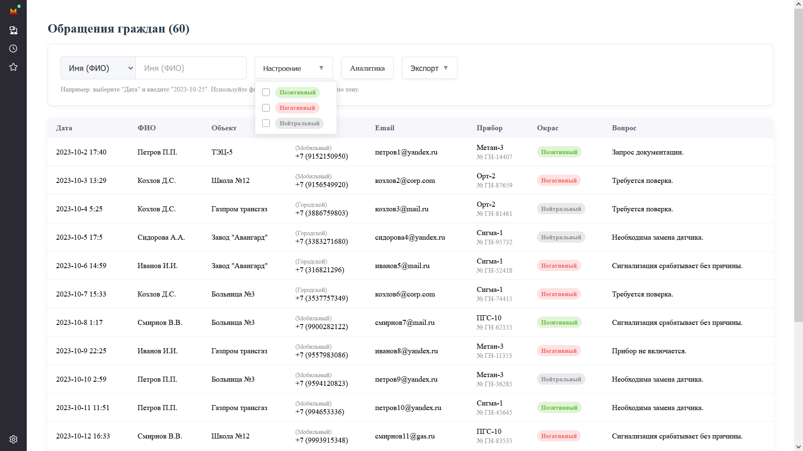
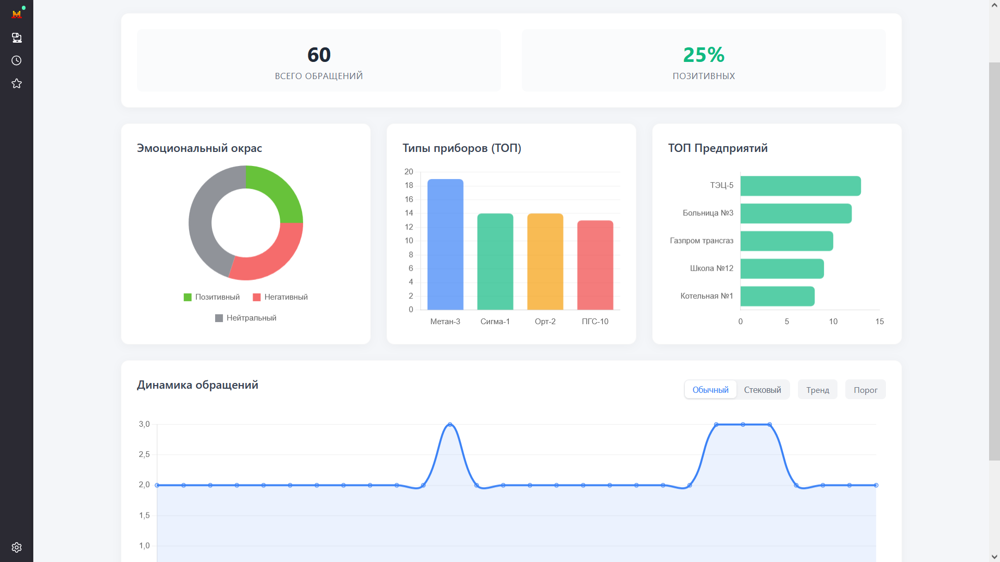

# Enigma Hack  
> AI-агент для автоматизации обработки писем технической поддержки газовой службы  

---

## 1. О проекте

Интеллектуальная система автоматизации службы поддержки, предназначенная для обработки входящих электронных писем от пользователей газовых служб. Система анализирует текст обращений, извлекает ключевые данные (ФИО, контакты, данные прибора), определяет эмоциональный окрас и тональность письма, а также генерирует обоснованный ответ на основе базы знаний приборов (RAG).

**Основные возможности:**
*   **Автоматическое извлечение данных:** Парсинг текста письма для получения ФИО, телефона, email, объекта и характеристик прибора.
*   **Анализ тональности:** Выявление недовольных клиентов для приоритетной обработки.
*   **Гибридный AI:** Сочетание локальной модели для обработки конфиденциальных данных и облачной модели для качественной генерации ответов.
*   **База знаний (RAG):** Использование документации к приборам для формирования точных технических ответов.
*   **Минимизация ручного труда:** Автоматическое заполнение базы данных и отправка ответов пользователям.

---

## 2. Архитектура

Система построена на принципах **гибридной архитектуры AI**, обеспечивающей баланс между качеством генерации, скоростью работы и безопасностью данных.

### Принцип работы
1.  **Вход:** Бэкенд опрашивает IMAP-сервер и передает тело письма в AI-модуль.
2.  **Локальная обработка (Privacy-first):** Письмо обрабатывается локальной моделью **Qwen 2.5 7B Instruct**. Извлекаются PII-данные (ФИО, телефон), исправляются опечатки и формируется краткая суть проблемы. Данные остаются внутри контура сервера.
3.  **Поиск решения (RAG):** Суть проблемы векторизуется моделью **E5-base** (поддерживает мультиязычные текста), в локальной базе **FAISS** ищутся релевантные инструкции из PDF-документации.
4.  **Генерация ответа:** Если решение найдено, суть проблемы и контекст отправляются в облачную модель **Qwen 2.5 14B** (Hugging Face) для генерации вежливого и формального ответа.
5.  **Выход:** AI-модуль возвращает структурированный JSON. Бэкенд сохраняет данные в PostgreSQL и отправляет ответ пользователю через SMTP.



---

## 3. Технологический стек

**Frontend:**
*   [SvelteKit](https://kit.svelte.dev/) — пользовательский интерфейс и аналитика.

**Backend:**
*   [FastAPI](https://fastapi.tiangolo.com/) — асинхронный веб-фреймворк.
*   [Pydantic](https://docs.pydantic.dev/) — валидация данных и настроек.
*   [PostgreSQL](https://www.postgresql.org/) — хранение данных обращений.

**AI & ML:**
*   **Local LLM:** Qwen 2.5 7B Instruct (GGUF) через `llama-cpp-python`.
*   **Cloud LLM:** Qwen 2.5 14B Instruct через Hugging Face Inference API.
*   **Embeddings:** `intfloat/multilingual-e5-base`.
*   **Vector Store:** FAISS (CPU).
*   **PDF Parser:** PyMuPDF.

**Infrastructure:**
*   Docker & Docker Compose.

---

## 4. Структура проекта

Проект организован как монорепозиторий с разделением фронтенда и монолитного бэкенда.

```text
project/
├── .env                  # Общие переменные окружения (ключи API, доступы к БД)
├── docker-compose.yml    # Оркестрация контейнеров
├── frontend/             # SvelteKit приложение
└── backend/              # FastAPI + AI сервис
    ├── .venv/            # Виртуальное окружение Python
    ├── app/
    │   ├── main.py       # Точка входа, инициализация FastAPI
    │   ├── config.py     # Загрузка конфигурации
    │   ├── api/          # Роутеры и эндпоинты
    │   ├── models/       # Pydantic схемы (Input/Output JSON)
    │   └── services/     # Ядро AI (Local LLM, RAG, Cloud LLM)
    ├── data/
    │   ├── knowledge_base/ # Папка для PDF файлов (База знаний)
    │   ├── faiss_index/   # Кэш векторного индекса
    │   └── models/        # Хранение весов локальных моделей (.gguf)
    ├── requirements.txt
    └── Dockerfile
```

---

## 5. Установка и запуск

### Требования
*   Docker и Docker Compose.
*   **Оперативная память:** Минимум **10-12 ГБ RAM** (для запуска Qwen 7B в оперативной памяти).
*   Hugging Face Token (для доступа к облачной модели 14B).

### Шаги запуска

1.  **Клонирование репозитория:**
    ```bash
    git clone <repo_url>
    cd project
    ```

2.  **Настройка окружения:**
    Создайте файл `.env` в корне проекта и заполните его по шаблону:
    ```env
    # Hugging Face
    HF_TOKEN=hf_xxxxxxxxxxxxx

    # Paths (внутри контейнера Docker)
    LOCAL_MODEL_PATH=./data/models/qwen2.5-7b-instruct-q4_k_m.gguf
    CLOUD_MODEL_NAME=Qwen/Qwen2.5-14B-Instruct

    # Database
    DATABASE_URL=postgresql://user:password@db:5432/gas_support
    ```

3.  **Подготовка модели:**
    Скачайте файл модели `qwen2.5-7b-instruct-q4_k_m.gguf` (например, с Hugging Face) и поместите его в папку `backend/data/models/`.

4.  **Подготовка базы знаний:**
    Поместите PDF-файлы с документацией приборов в папку `backend/data/knowledge_base/`.

5.  **Сборка и запуск:**
    ```bash
    docker-compose up --build
    ```
    При первом запуске система автоматически проиндексирует PDF-файлы (создаст FAISS index).

---

## 6. Использование AI-модуля

### Обработка писем
AI-модуль работает в синхронном режиме внутри эндпоинта `/process`. Система спроектирована так, чтобы не блокировать основной поток FastAPI, используя `run_in_executor` для тяжелых вычислений на CPU.

### Обновление базы знаний (Hot Reload)
Для добавления новых инструкций или обновления документации не требуется пересборка или перезапуск Docker-контейнера. Это критически важно для поддержания бесперебойной работы сервиса, так как перезапуск контейнера влечет за собой повторную загрузку LLM-модели в оперативную память, что занимает значительное время (до 1-2 минут) и делает сервис недоступным.

**Алгоритм обновления:**
1.  Добавьте новые PDF файлы в папку `backend/data/knowledge_base/`.
2.  Отправьте POST запрос на эндпоинт `/api/v1/reload-kb`.
3.  Система пересканирует папку, обновит векторный индекс и сохранит его на диск "на лету", оставаясь доступной для обработки входящих писем.

### Обработка ошибок и отказоустойчивость
*   Если в базе знаний нет ответа, система автоматически проставляет флаг `escalate_to_operator: true`.
*   При недоступности облачного API (HF) используются повторные попытки (Exponential Backoff). При исчерпании попыток тикет передается оператору.

---

## 7. Frontend

Веб-интерфейс разработан на **SvelteKit** и предоставляет удобные инструменты для мониторинга и анализа работы системы.

### Основной функционал

#### Таблица обращений
Главная страница отображает список всех обработанных обращений с возможностью:
*   **Пагинации и фильтрации:** Быстрый поиск нужного тикета.
*   **Экспорта данных:** Выгрузка таблицы в форматах `.csv` и `.json`.

> **Важно:** Прямой экспорт в формат `.xlsx` намеренно отключен. Использование библиотек для Excel увеличивает размер клиентского бандла на 30-50 Кб и может вызывать зависание интерфейса при экспорте больших объемов данных (от 10 000 записей). Поскольку Microsoft Excel корректно открывает файлы `.csv`, выбор сделан в пользу производительности и легкости приложения.

#### Аналитика
Раздел "Аналитика" предоставляет визуализацию статистики работы службы поддержки:
*   **Круговая диаграмма:** Распределение тональности обращений (положительные, негативные, нейтральные).
*   **Гистограммы:**
    *   Топ-5 самых упоминаемых типов приборов.
    *   Топ-5 компаний, обратившихся в службу поддержки.
*   **Линейный график (Line Chart):** Динамика количества обращений по датам.




---

## 8. API-документация

Основные эндпоинты, предоставляемые бэкендом:

### `POST /api/v1/process`
Принимает тело письма, возвращает структурированные данные и ответ.

**Request Body:**
```json
{
  "email_body": "Здравствуйте, Иванов Иван. Мой газоанализатор ГА-01 зав. номер 123 не включается. Телефон +7900..."
}
```

**Response Body:**
```json
{
  "extracted_data": {
    "name": "Иванов Иван",
    "phone": "+7900...",
    "device_type": "ГА-01",
    "device_serial": "123"
  },
  "analysis": {
    "sentiment": "neutral",
    "summary": "Газоанализатор ГА-01 не включается."
  },
  "resolution": {
    "response_text": "Уважаемый Иван, проверьте питание...",
    "escalate_to_operator": false
  }
}
```

### `POST /api/v1/reload-kb`
Принудительная перезагрузка базы знаний из PDF файлов без простоя сервиса.

---
*Разработано для хакатона Enigma Hack.*